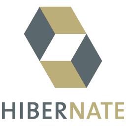
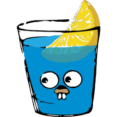
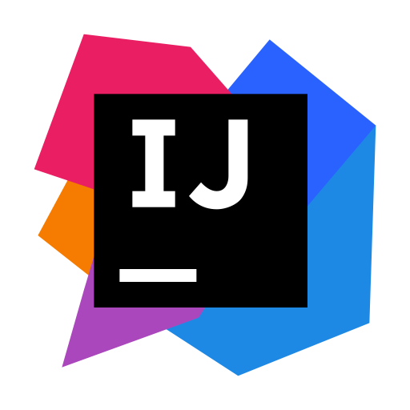
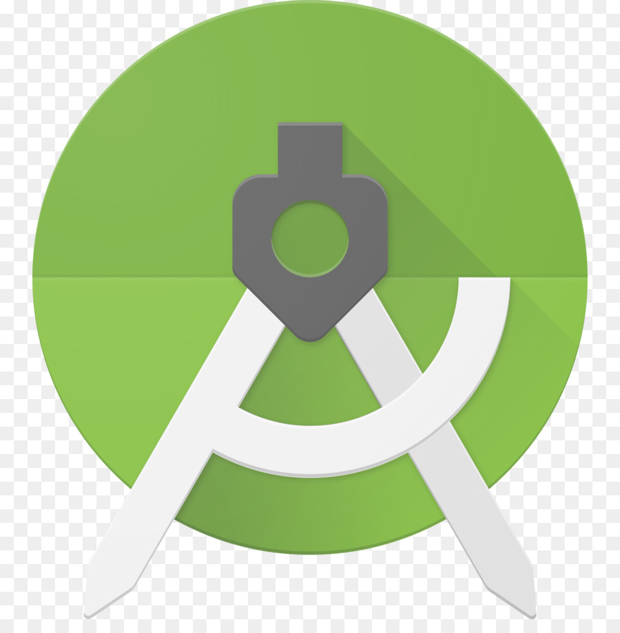
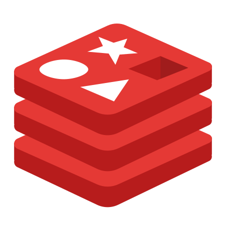
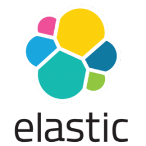

<!--
**opannapo/opannapo** is a ✨ _special_ ✨ repository because its `README.md` (this file) appears on your GitHub profile.
Here are some ideas to get you started:
- 🔭 I’m currently working on ...
- 🌱 I’m currently learning ...
- 👯 I’m looking to collaborate on ...
- 🤔 I’m looking for help with ...
- 💬 Ask me about ...
- 📫 How to reach me: ...
- 😄 Pronouns: ...
- ⚡ Fun fact: ...
-->
 

#### » Ynewbie Malamsenent
<div style="background-color: rgb(50, 50, 50);">
```
   _ _ __                                             __ _ _   
  / / / /__   ___    __ _ _ __   _ __   __ _ ___    __\ \ \ \  
 / / / /    \|   `\ /  ` | '_  \| '_  \/  ` |   `\/    \ \ \ \
( ( ( (  ()    | ) ) ( | | | |    | | | ( | | | )   ()  ) ) ) )
 \ \ \ \ __ /|  _,/ \__,_|_| |_||_| |_|\__,_|  _,/\ __ / / / / 
  \_\_\_\====|__============================|__=======/_/_/_/               
  
```
</div>

#
<!--
#### » Programming Languages 🌱  
<table>
<thead>
<tr>
<th align="center"><a target="_blank" rel="noopener noreferrer"></a></th>
<th align="center"><a target="_blank" rel="noopener noreferrer"></a></th>
<th align="center"><a target="_blank" rel="noopener noreferrer"></a></th>
<th align="center"><a target="_blank" rel="noopener noreferrer"></a></th>
</tr>
</thead>
</table>
-->
<!--
#### » Framework
<table>
<thead>
<tr>
<th align="center"><a target="_blank" rel="noopener noreferrer"></a></th>
<th align="center"><a target="_blank" rel="noopener noreferrer"></a></th>
<th align="center"><a target="_blank" rel="noopener noreferrer"></a></th>
<th align="center"><a target="_blank" rel="noopener noreferrer"></a></th>
<th align="center"><a target="_blank" rel="noopener noreferrer"></a></th>
<th align="center"><a target="_blank" rel="noopener noreferrer"></a></th>
<th align="center"><a target="_blank" rel="noopener noreferrer"></a></th>
</tr>
</thead>
</table>
-->

<!--
#### » Tools
<table>
<thead>
<tr>
<th align="center"><a target="_blank" rel="noopener noreferrer"></a></th>
<th align="center"><a target="_blank" rel="noopener noreferrer"></a></th> 
<th align="center"><a target="_blank" rel="noopener noreferrer"></a></th>
<th align="center"><a target="_blank" rel="noopener noreferrer"></a></th>
</tr>
</thead>
</table>
-->

<!--
#### » Database
<table>
<thead>
<tr>
<th align="center"><a target="_blank" rel="noopener noreferrer"></a></th>
<th align="center"><a target="_blank" rel="noopener noreferrer"></a></th> 
<th align="center"><a target="_blank" rel="noopener noreferrer"></a></th>
<th align="center"><a target="_blank" rel="noopener noreferrer"></a></th>
<th align="center"><a target="_blank" rel="noopener noreferrer"></a></th>
</tr>
</thead>
</table>
-->
